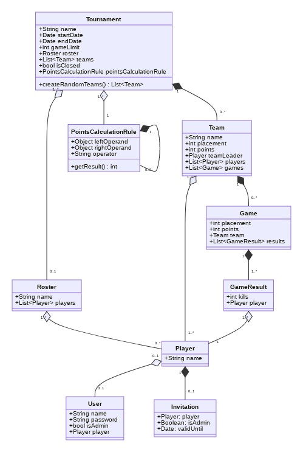

# CoD WZ: tournament API

## Introduction

Backend to manage private CoD WZ tournaments.

## Quick start with Docker

1. Start the database and the server

```bash
./utils/local_run_docker.sh
```

This will start a PostgreSQL database, run the migrations and
build a Docker image with the current application sources.

The API server will then be started on port `$SERVER_PORT` (**8888** by default).

2. Create an admin user

```bash
docker-compose exec app utils/create_admin.sh
```

## Local setup

1. Install dependencies

```bash
npm install
```

2. Run the server

```bash
./utils/local_run.sh
```

This will start a dockerised PostgreSQL database, expose its port on `$PGPORT` (**5432** by default)
and run the migrations.

The API server will then be started on port `$SERVER_PORT` (**8888** by default).

3. Create an admin user

In another shell, run:

```bash
./utils/create_admin.sh
```

## Test the API

Go to http://localhost:8888/graphql (or http://localhost:`$SERVER_PORT`/graphql)

Login with the following mutation:

```graphql
mutation {
  login(username: "$ADMIN_USERNAME", password: "$ADMIN_PASSWORD")
}
```

And save the JWT token you get in response.

Then click on `HTTP HEADERS` in the lower left corner of the playground and add:

```graphql
{
  "Authorization": "Bearer $JWT_TOKEN"
}
```

You may now run queries:

```graphql
query {
  findUsers {
    username
  }
}
```

## Configuration

In order to run `node index.js` directly and/or override the default configuration, you need to export the following variables:
* Required
  * PGUSER="cod-wz-tourney"
  * PGPASSWORD="cod-wz-tourney"
  * PGDATABASE="cod-wz-tourney"
* Optional
  * NODE_ENV="dev"
  * SERVER_PORT="8888"
  * PGHOST="localhost"
  * PGPORT="5432"
  * PGSCHEMA="public"
  * LOG_LEVEL="info"
  * LOG_FILE=""
  * LOG_MAX_SIZE="10m"
  * LOG_MAX_FILES="7d"

The PostgreSQL variables let you run the API server against your own database. The defaults target the Docker instance defined in `docker-compose.yml`.

The scripts in the `utils/` directory will load these values from the `.env` file.

## Database migrations

This project uses [sequelize](https://sequelize.org/master/) to manage database migrations.

In order to create a new migration, run:

```bash
npx sequelize-cli migration:generate --name $MIGRATION_NAME
```

Then edit the newly created SQL file: `migrations/*-$MIGRATION_NAME.js`

Refer to the [documentation](https://sequelize.org/master/manual/migrations.html) to learn how to write a migration.

After that, you will need to trigger the migrations manually with:

```bash
npx sequelize-cli db:migrate
```

At least the following envrionment variables are required:
* NODE_ENV="dev"
* PGUSER="cod-wz-tourney"
* PGPASSWORD="cod-wz-tourney"
* PGDATABASE="cod-wz-tourney"

## Logging

This project uses [winston](https://github.com/winstonjs/winston) and [winston-daily-rotate-file](https://github.com/winstonjs/winston-daily-rotate-file) to manage its logs.

By default, messages are written in a human-readable format to the console. In order to enable logging in JSON to a file, set the `LOG_FILE` environment variable (cfr. below).

The following envrionment variables can be used to configure the logging behavior:
* LOG_LEVEL="info"
* LOG_FILE=""
* LOG_MAX_SIZE="10m"
* LOG_MAX_FILES="7d"

## Generate documentation based on comments in source files

Basic source code documentation can be generated with the help of [docco](https://ashkenas.com/docco/).

The command to use is:

```bash
npx docco *.js graphql/resolvers/*.js models/*.js
```

The resulting HTML files will be saved in the `docs/` directory.

When writing comments, make sure they are single-line (multi-line is not supported).

## Class diagram

View and edit `docs/class-diagram.mmd` on [Mermaid Live Editor](https://mermaid-js.github.io/mermaid-live-editor/).


